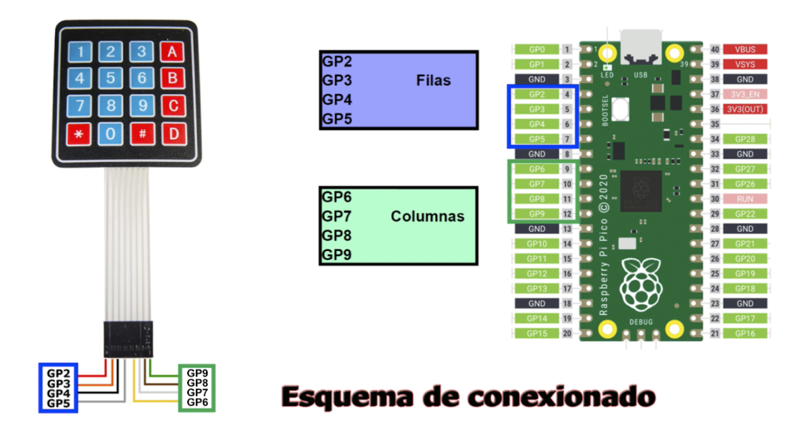
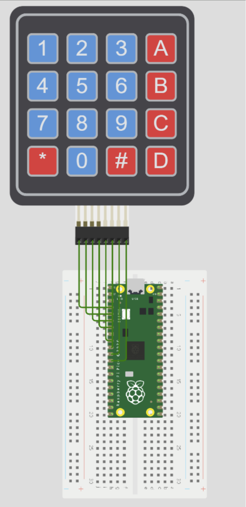
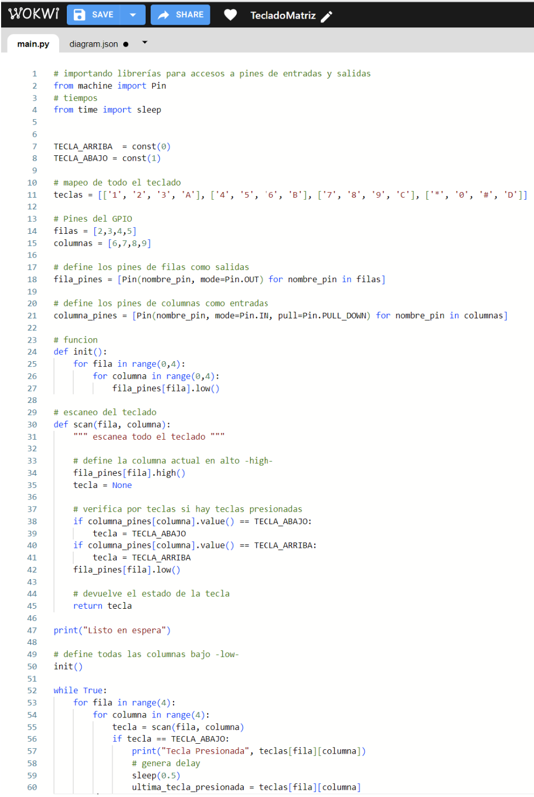

# _Exposición de Sensor: Keypad_

Tecnológico​ ​Nacional​ ​de​ ​México - Instituto Tecnológico de Tijuana

Subdirección académica - Departamento de Sistemas y Computación

**Semestre:** 
Agosto - Diciembre 2023

**Carrera:**
Ing. Sistemas computacionales

**Materia:**
Sistemas programables

**Título de la tarea: ​**
**_Expo del sensor elegido: Keypad_**

**Unidad a evaluar: ​**
​Unidad 1 - Sensores

**Nombre y número de control de alumno:**
 Jiménez Rivera Paulina – No. de control: 20211796

**Nombre del maestro (a):**
Rene Solis Reyes

**Fecha de entrega:**
13 de septiembre de 2023

-----------------------------------------------------------------------------------------------------------------------------------------

## Introducción

**Exposición**
**_Por: Paulina Jiménez Rivera 20211796_**

**Objetivo:**
Se busca conocer de manera general los diferentes sensores que se pueden incluir en un proyecto,
uno de los más comunes es el keypad, por lo que se dará un pequeño resumen de algunas de sus 
características.

## Marco Teórico:
El keypad es un conjunto de botones/pulsadores alineados en forma de
matriz (filas y columnas).
Se utiliza como un elemento de entrada de datos numéricos, por ejemplo:
* calculadores
* teléfonos
* cajeros

Proporciona un interfaz de entrada muy sencilla de utilizar en los proyectos con Arduino.

**Especificaciones del teclado matricial 4×4**
* Contamos con 16 botones de organización matricial. (4 columnas, 4 filas).
* Teclado de tipo membranal.
* Máxima resistencia al agua y al polvo.
* Cuenta con un autoadhesivo en la parte trasera del teclado.
* El tiempo de rebote se encuentra en promedio de ≤5 ms.
* Cable de cinta plana con longitud de 8.5 cm de largo aprox. (incluido con el conector)
* Conectores de tipo DuPont hembra de una fila y 8 contactos con separación estándar 0.1″ (equivalente a 2.54mm)
* Temperatura de operación óptima: 0 a 50 °C

**Componentes**
Para demostrar el funcionamiento del Keypad se utilizó la herramienta de "WOKWI" para realizar el modelado de las conexiones, código y ejecución del sensor. Se utilizaron un Raspberry Pi Pico y el Keypad o teclado matricial. 
> Es importante tener claro las filas y columnas con las que se cuentan, para poder hacer
> de manera correcta las conexiones y se obtenga un funcionamiento correcto.

**Aplicaciones**
Podemos emplear los teclados matriciales en nuestros proyectos de electrónica y robótica, por ejemplo, para cambiar el modo de funcionamiento de un montaje, para solicitar un password, como teclas de dirección para controlar un brazo robótico o un vehículo, o proporcionar instrucciones a un robot.

## Funcionamiento de Keypad

**Conexiones**

Para las conexiones de los diferentes elementos se utilizó el siguiente esquema de conexiones 
que indica el orden de cada uno.

-----------------------------------------------------------------------------------------------------------------------------------------
_Vista general de modelo_
-----------------------------------------------------------------------------------------------------------------------------------------

**Ejecución y resultados**

Para poder realziar la ejecución del modelo se tiene que insertar el código correspondiente, 
el cual incluye varios elementos, como las librerías, constantes, mapeo del teclado, funcion, y las reglas que se decidan agregar, como se puede ver a continuación:

> Por último, se puede ver el funcionamiento correcto del Keypad por medio del despliegue de
> la tecla que corresponda a la que se esté presionando en la ejecución, por ejemplo, si se
> presiona el 4 se desplegará "Tecla Presionada 4".

